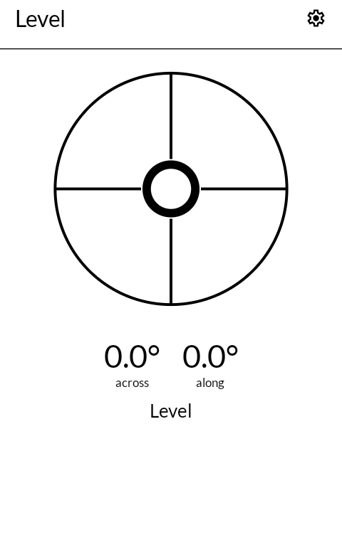
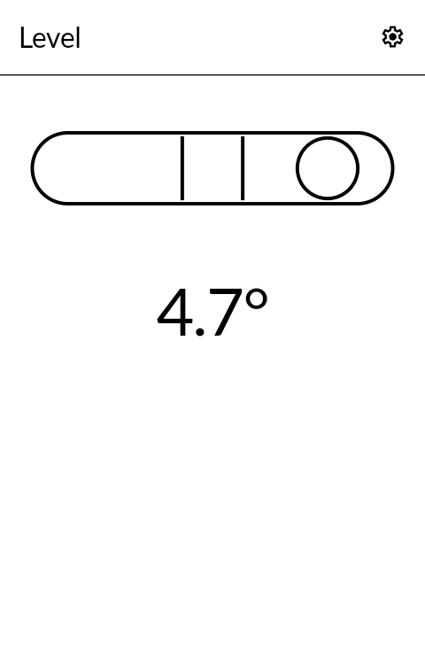
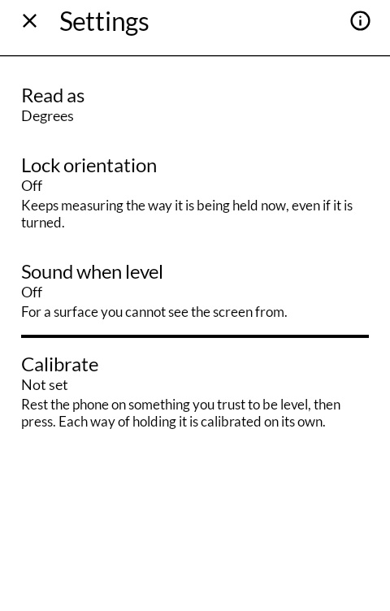
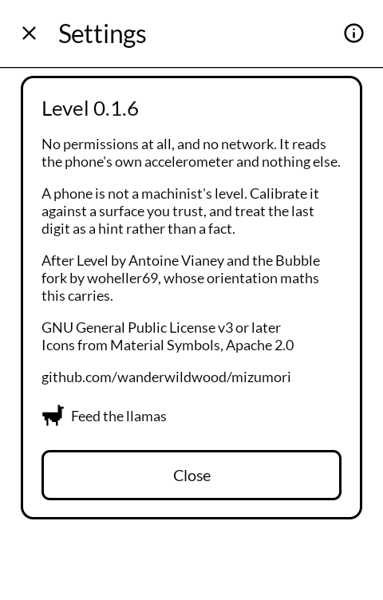

# Level

水盛 *mizumori* — the water level a carpenter used before there was a bubble in a tube.

A spirit level for an E Ink phone. Black on white, one line weight, and nothing on the
screen that is not the instrument.

Built for the [Mudita Kompakt](https://mudita.com/products/kompakt/), whose 4.3" panel has
sixteen greys, a slow redraw, and is read outdoors as often as indoors.

## Screenshots

| | | | |
|---|---|---|---|
|  |  |  |  |

## How it works

**It knows how you are holding it.** Lying on its back it is a bullseye with two axes,
across and along. Stood on any of its four edges it is a tube with one. You do not choose
a mode; a level you have to operate is not a level.

**The bubble rises to the high side**, as a real one does, and stops against the end of
its travel rather than vanishing.

**It says "Level" only when it is**, and the bubble's ring thickens at the same moment. A
label reading "not level" the rest of the time would say nothing the bubble has not said
already.

**Degrees or percent.** Press the number to swap. A carpenter wants degrees; a fall or a
ramp is specified as a grade, and a 1-in-80 drainage fall is much more usefully 1.25% than
0.72°.

**Calibration is per orientation.** Rest the phone on something you have another reason to
trust and press Calibrate. A phone rarely sits at the same angle on its back as on its
edge — the camera bump alone sees to that — so one offset for all five ways of holding it
would correct one and spoil four.

**Sound when level**, for a surface you cannot see the screen from.

## What it does not do

No permissions at all. Android does not gate the motion sensors, so there is nothing to
ask for and nothing to grant. There is no network code in it.

The accelerometer runs only while the app is the screen you are looking at.

## Two things about E Ink

The screen is only asked to redraw when a digit that is actually shown changes. The sensor
reports many times a second and nearly all of those readings round to the number already
on the panel; repainting for them is the difference between an instrument and a flicker.

The bubble is a ring rather than a filled disc. A solid moving circle is the shape E Ink
ghosts worst, and the vial would fill up with the faint trail of where the bubble has
been. A ring that doubles its stroke weight says the same thing and leaves nothing behind.

Upstream offers a bubble "viscosity" — how sluggishly the bubble follows. That is a
setting about an animation, and there is no animation here, so it went.

## Honestly

A phone's accelerometer is not a machinist's level. Calibrate against something you trust,
and treat the last digit as a hint rather than a fact.

## Building

```
./gradlew assembleRelease
```

A release is signed by a keystore in `signing/`, which is not in this repository. Without
it the release APK builds **unsigned** and will not install anywhere — there is no
fallback key by design.

## Credit

After [Level](https://github.com/avianey/Level) by Antoine Vianey (2014) and the
[Bubble](https://github.com/woheller69/level) fork by woheller69, from which this carries
the orientation maths — in particular the trick of feeding `getRotationMatrix` a constant
dummy magnetic field, since a spirit level has no interest in which way north is.

The interface is a rebuild rather than a reskin: Jetpack Compose against
[MMD](https://github.com/mudita/MMD), Mudita's E Ink component library, where the original
is Android views and a `SurfaceView` painter.

Icons are [Material Symbols](https://fonts.google.com/icons), Apache License 2.0.

## Support

This is free software and it stays free; there is nothing here to buy. If you would like to
send something somewhere anyway, there are some llamas who go through a great deal of hay:
<https://hotspringsllamas.org/donate/>

## Licence

**GNU General Public License v3.0 or later.** See [LICENSE](LICENSE).

Note that this is *or later*, not the GPL-3.0-only these apps otherwise use. The work it
derives from was published under "version 3 of the License, or (at your option) any later
version", and that option was granted to everyone downstream. It is not mine to take away.

Copyright © wander wildwood, and © 2014 Antoine Vianey for the parts that are his.
